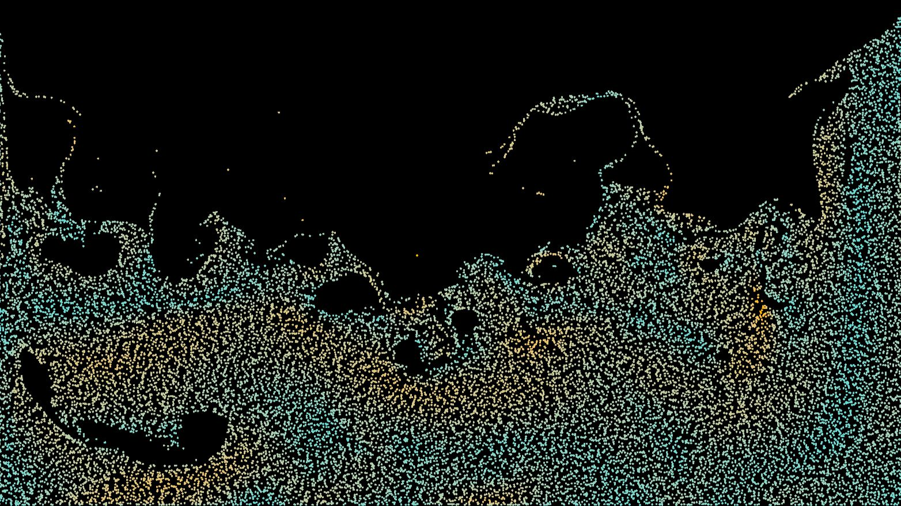
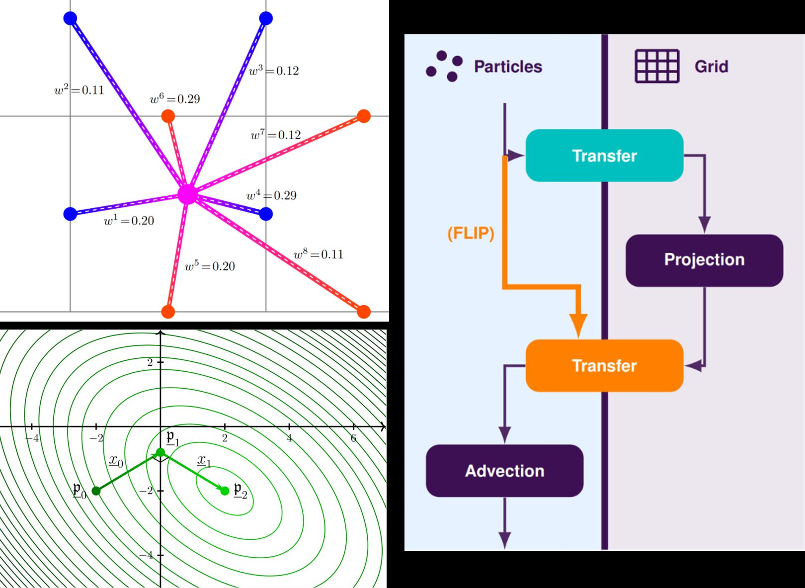
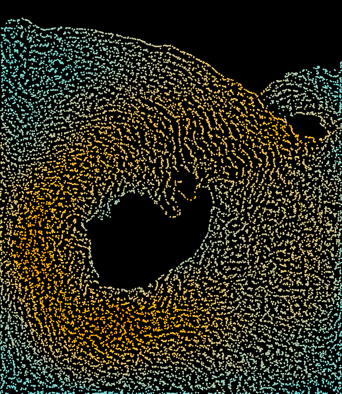
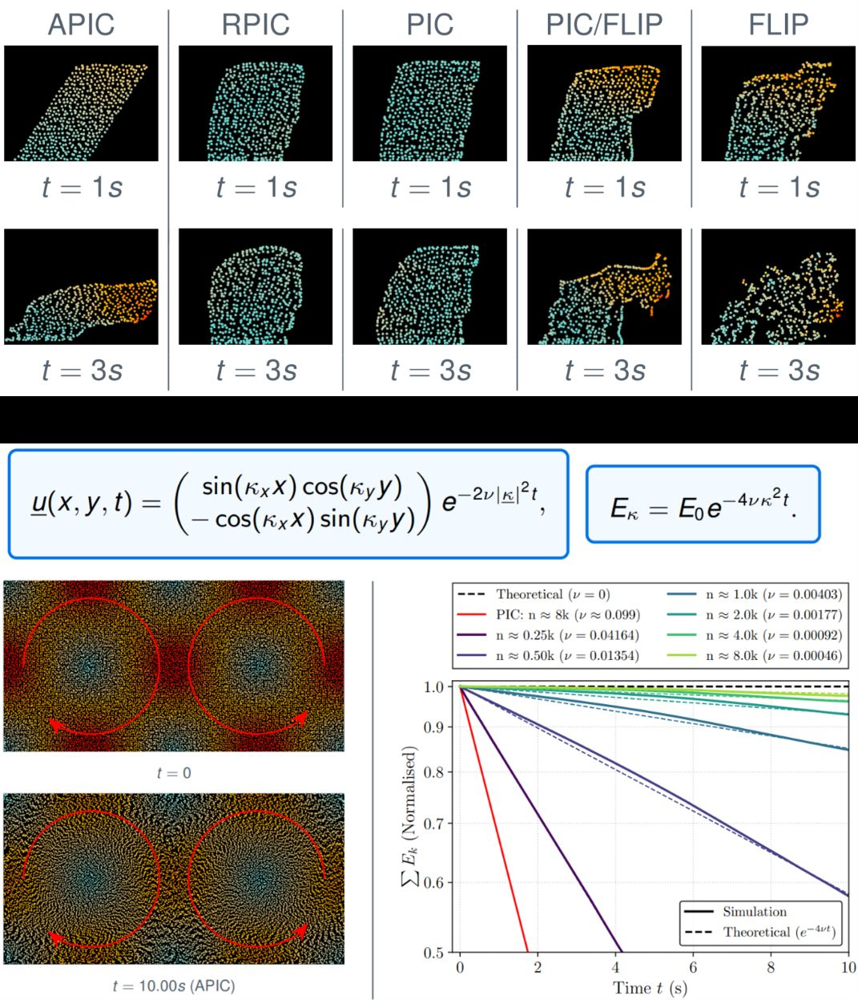
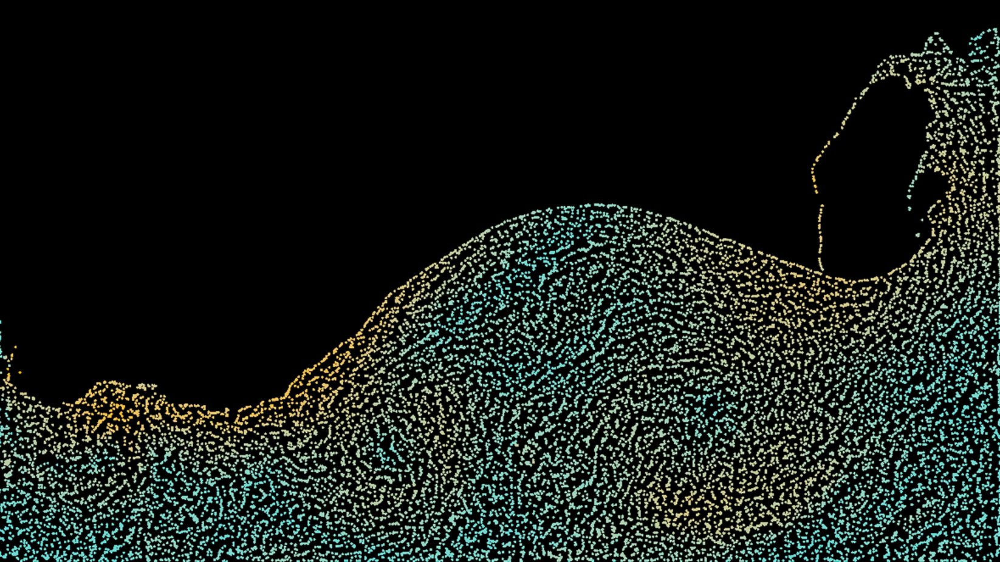
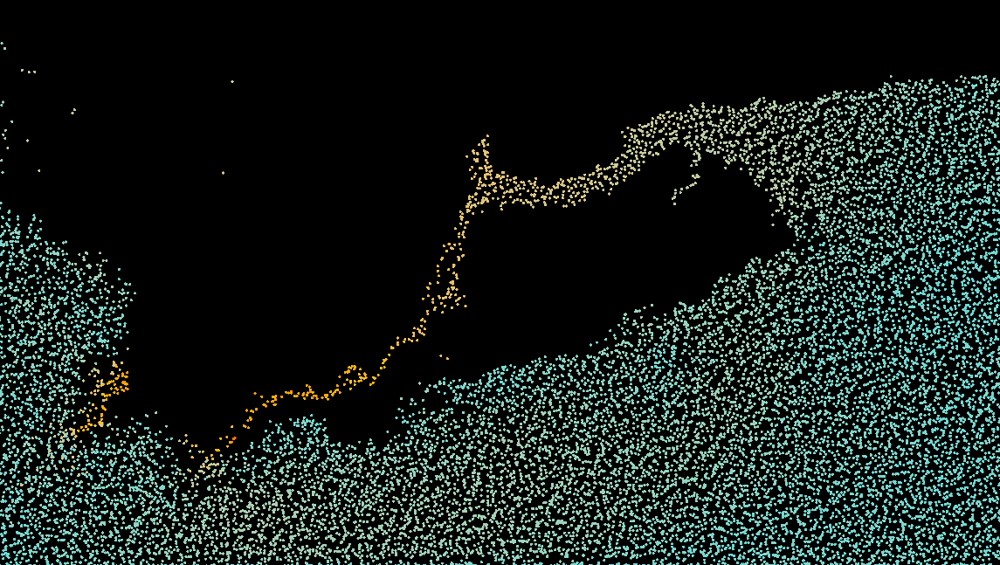

# Real-time Simulations of Momentum-Conserving Vortices using Affine Velocity Approximations


---

A real-time *hybrid* Euler-Lagrange **Fluid Simulation**, that uses the PIC, FLIP, and **APIC** methods respectively (which are on the cutting edge of CFD) to explore the interaction of high performance, momentum conserving vortices.

In these *hybrid* models, we constantly switch between particle-based and staggered MAC grid-based approaches, in an attempt to combine the strengths of Lagrangian advection and Eulerian projection. The Affine-PIC model in particular attempt to reduce the numerical dissipation which is naturally present in the transfer between these schemes (which typically appears as a loss of angular momentum) by 'doping' each particle with an affine velocity field, containing their angular information. In this way, we better preserve vortex information and rotation, making this method applicable to large-scale aviation or weather monitoring, in which effects such as vortex shedding and turbulence are essential to generating accurate results.

My simulation, which involves novel application of these algorithms to my specific domains (see the technical details below), is written in C#, rendered as a fragment shader using Instanced Procedural Drawing, and heavily optimised through parallelism on the GPU using HLSL compute shaders.  
This open-source code forms part of a wider research project, on studying the emergence and angular momentum properties of vortices in a large-scale fluid system, and the advantages of these *hybrid* regimes over more typical solvers, such as direct solvers or SPH. This involves an accompanying LaTeX paper, documenting my research, implementation, and unique findings as a rigorous, well-referenced mathematical essay.

This work as a whole is accredited with the University of Warwick's Department of Mathematics, under the 'MA369 3rd Year Essay' module, and is supervised by Dr Radu Cimpeanu.

<p align="center">
  
</p>

---

## Features and Highlights

✅ Bi-linear interpolation operators to transfer between particle and grid states, optimised heavily via parallelisation.  
✅ Robust handling of both grid and particle boundary conditions (Dirichlet & Periodic), that match physical intuition whilst maintaining efficient coding practices.  
✅ Particle advection through Runge-Kutta.  
✅ Grid projection handled through an implementation of a heavily optimised CGM algorithm, using divergence calculations and pressure updating models.  
✅ Successful extraction of particle and grid velocity gradient information (both shear and angular), and subsequent 'doping' onto the grid, through both rigid and affine velocity approximations (ie: RPIC and APIC).  
✅ Real-time tracking of global physical quantities (eg: angular momentum, kinetic energy), for debugging and testing.  
✅ Identified a novel Reynolds Number value of 5419.69 (16,000 APIC particles per vortex) under the Taylor-Green Vortex - a remarkable value for real-time CFD (for refernce, standard PIC yields Re = 10.27 in the same setup).  
✅ Intuitive interaction of the fluid through the Unity Game engine, allowing the user to exert complex forces via their mouse, or adjust the physics / model in real-time.  
✅ Rendering of particles through HLSL compute shaders, written under the 'Instanced Procedural Drawing', and subsequent memory management to and from the GPU through compute buffers.  
✅ Educational illustration of the grid, and their velocity components, through the Unity 'Gizmos' system.  
✅ Supports a wide range of initial particle configurations, for comparing with analytic solutions.  
✅ Object-Oriented design of cells and particles, with easy transfer and information sharing.  
✅ Well-referenced, mathematically rigorous <a href="https://www.alfiekunz.co.uk/academia/assets\projects/ProjectAPIC/Real-time Simulations of Momentum-Conserving Vortices - Alfie Kunz.pdf" target="_blank" rel="noopener noreferrer">supporting essay</a>, written in LaTeX and containing intuitive, novel Tikz figures and simulation screenshots.

### Conjugate Gradient Method (CGM) Optimisations

✅ Preconditioning of CGM, using Incomplete Cholesky Factorisation.  
✅ Implementation of drop-tolerance thresholding in the PCG algorithm.  
✅ Creation of a 'fluid neighbourhood lookup' to construct the matrices required for CGM.  
✅ Development of a novel adaptation of the Compressed-Sparse-Row (CSR) matrix form, for optimised handling of both upper and lower triangular matrices.  
✅ Implemented efficient operations using said matrices, including adding and retrieving elements, manipulation of rows and columns, vector products, and forwards and backwards substitution solvers.  
✅ Strong code profiling, using advanced C# memory and heap management techniques.  
✅ Restricting long-term volume loss by introducing an implicit 'stiffness' coefficient (which also serves as a form of surface tension) and density control.  

---

## Project Showcase

> **Project Demo:** You can see this project live directly through a [**series of demos**](https://drive.google.com/open?id=1ia5E2c9Rarqljp6nQN1vnYvEcbTgDwk2) (Intel 64-bit). Simply download the subfolder of choice, and run the "Fluids Simulation.exe" application.

> **Demo Controls:**  
Space: Play / Pause Simulation.  
Left / Right Arrow Keys: Advance Simulation by ±1 Frame (when paused).  
R: Reset Simulation.  
Left Click: Repel Fluid from Mouse.  
Right Click: Attract Fluid towards Mouse.  
Left + Right Click: Turns the Mouse into a source of gravity!  

> **Accompanying Essay & Presentation** You can also access the <a href="https://www.alfiekunz.co.uk/academia/assets\projects/ProjectAPIC/Real-time Simulations of Momentum-Conserving Vortices - Alfie Kunz.pdf" target="_blank" rel="noopener noreferrer">**Mathematical Essay**</a> and <a href="https://www.alfiekunz.co.uk/academia/assets/projects/ProjectAPIC/MA395 Warwick Presentation - Alfie Kunz.pdf" target="_blank" rel="noopener noreferrer">**Related Presentation Slides**</a> that encompass this project.

Alternatively, one can download the source code, as instructed below, for full control.

<table align="center" width="100%">
  <tr>
    <td align="center" valign="middle" width="40%" colspan="2">
      <p align="center"><b>Theoretical PIC Diagrams</b></p>
      
    </td>
    <td align="center" valign="middle" width="30%" colspan="2">
      <p align="center"><b>Example APIC Simulation</b></p>
      
    </td>
    <td align="center" valign="middle" width="30%" colspan="2">
      <p align="center"><b>APIC Shear & Taylor-Green Vortex Results</b></p>
      
    </td>
  </tr>
  <tr>
    <td align="center" valign="middle" width="50%" colspan="3">
      <p align="center"><b>Example PIC Simulation</b></p>
      
    </td>
    <td align="center" valign="middle" width="50%" colspan="3">
      <p align="center"><b>Example FLIP Simulation</b></p>
      
    </td>
  </tr>
</table>

---

## Technical Details

Fluid solvers broadly fall into two camps: **Eulerian** (a fixed grid - great at pressure projection and boundary handling, but cannot handle advection) and **Lagrangian** (free particles - great at advection and complex shapes, but ill-handles discrete gradient operators for projection). PIC bridges the two by constantly transferring information between the grid and particle representations each timestep: the grid handles projection, the particles handle advection, and thus we get a solver that's fast *and* geometrically flexible.

Enforcing incompressibility on the grid comes down to a Helmholtz-style decomposition: take the divergence of the velocity field, solve a discrete Poisson equation for a scalar pseudo-pressure, then subtract its gradient back out. On a staggered MAC grid this becomes a sparse, symmetric positive-definite linear system, solved via a Preconditioned Conjugate Gradient Method (with the preconditioner being the Incomplete Cholesky factorisation, with drop-tolerance thresholding, level-0).

Unfortunately, bilinear interpolation between particles and the grid is a many-to-few mapping (8 particle degrees of freedom for a single grid cell consisting of 2 velocity components), the smoothing of which (via the 'averaging' of which) destroys rotational information - the fluid looks very gelatinous, and vortices do not emerge. FLIP 'bodges' this by transferring the *change* in grid velocity rather than overwriting particles outright, trading stability for energy conservation. RPIC and APIC take a different, more mathematically elegant route: rather than treating each particle as a single point, they 'dope' them with a local velocity-gradient matrix - antisymmetric only (rigid) for RPIC, full affine for APIC. This carries each particle's own angular momentum through the transfer. By generalising to APIC, we require the inverting of the local moment of inertia tensor, however by 'winding this back' through the bilinear weights used for interpolation, no explicit matrix inversion is needed.

The payoff is abundantly clear when comparing against the analytical Taylor-Green vortex: PIC's energy decays nearly instantly, while APIC tracks the inviscid solution closely even at small particle counts, whilst still running entirely in real time.

Please see the "Project Showcase" section for a full description of these methods.

---

## Installation, and Folder Structure

### Required Software: Unity (Editor of Export: 6000.5.3f1), Visual Studio (Community 2026).

To install, simply clone this repository using the following terminal prompts.
```bash
git clone https://github.com/AlfieKunz/CFD-APIC-Vortices
cd CFD-APIC-Vortices
```

Feel free to also fork this repository, open an issue, or submit pull requests. All contributions welcome! :)  
To better navigate this project, please see below for the related folder structure.

```
CFD-APIC-Vortices                                                     
└─ Assets                                                             
   ├─ Editor                                                            
   │  └─ CustomInspector.cs                                           // Adds buttons to the inspector
   ├─ Resources                                                       //
   │  ├─ CircleMaterial.mat                                           // Circular mesh shape (2 triangles), used by every particle to achieve Instanced Procedural Drawing
   │  └─ CircleShader.shader                                          // HLSL for drawing meshes to the GPU for each particle; colour depends on relative speed
   ├─ Scripts                                                         //
   │  ├─ CameraConfig.cs                                              // Scales the Unity camera so all cells fit neatly on the screen
   │  ├─ Cell.cs                                                      // Class for the grid of cells: data for CGM and neighbourhood lookup (in 1D and 2D), weight calibration for BiLerp, buffers for FLIP and APIC
   │  ├─ FluidSim.cs                                                  // Handles setup, rendering, and user inputs of the simulation: initialising grid & particles, constructing GPU buffers and quad-meshes, Unity gizmos for cell viewing
   │  ├─ GlobalSettings.cs                                            // Class of all user-editable settings in the inspector, appropriate adjusting of simulation
   │  ├─ GlobalSettingsResetter.cs                                    // Instantiates Settings buffer at runtime
   │  ├─ Interpolation.cs                                             // Computes and transferring velocity and angular momentum (APIC) information between grid & particle representations, in parallel
   │  ├─ ModeSwitcher.cs                                              // Buttons for switching between CFD regimes in real-time
   │  ├─ Particle.cs                                                  // Structure for holding & computing particle data: grid location, momentum information, sub-structure for render information
   │  ├─ PCG.cs                                                       // Preconditioned Conjugate Gradient Method (CGM): divergence calculations, neighbourhood lookup computation, Incomplete Cholesky Factorisation, PCG algorithm, pressure projection
   │  ├─ Simulation.cs                                                // Runs the main simulation: applying user interactions & external forces, preparing and handling PCG, Runge-Kutta, cell & particle boundary conditions, tracking of global values
   │  └─ VectorMatrix.cs                                              // Helper class for storing, retrieving, and efficiently operating on triangular matrices, operations for vectors, forward & backward substitution solvers
   └─ Simulation Logs                                                 // Folder tracking global physical quantities over a simulation
```

---

## References & Inspiration

Project affiliated with the University of Warwick Department of Mathematics, under the 'MA395 Essay' module, and supervised by Dr Radu Cimpeanu.  
If you use this code or data in your work, please cite the associated preprint:

**Text Citation:**
> Kunz, A. (2026). *Real-time Simulations of Momentum-Conserving Vortices using Affine Velocity Approximations*. MA395 Essay, Department of Mathematics, University of Warwick. Supervised by Dr. Radu Cimpeanu. Available at https://github.com/AlfieKunz/CFD-APIC-Vortices.

**BibTeX:**
```bibtex
@misc{Kunz2026Vortices,
  title = {Real-time Simulations of Momentum-Conserving Vortices using Affine Velocity Approximations},
  author = {Kunz, Alfie},
  howpublished = {MA395 Essay, Department of Mathematics, University of Warwick},
  year = {2026},
  note = {Supervised by Dr. Radu Cimpeanu},
  url = {https://github.com/AlfieKunz/CFD-APIC-Vortices}
}
```

Project inspired by <a href="https://www.youtube.com/watch?v=XmzBREkK8kY" target="_blank" rel="noopener noreferrer">Ten Minute Physics</a>, <a href="https://www.taylorfrancis.com/books/mono/10.1201/9781315266008" target="_blank" rel="noopener noreferrer">Robert Bridson</a>, and <a href="https://dl.acm.org/doi/abs/10.1145/2766996" target="_blank" rel="noopener noreferrer">C. Jiang</a>.